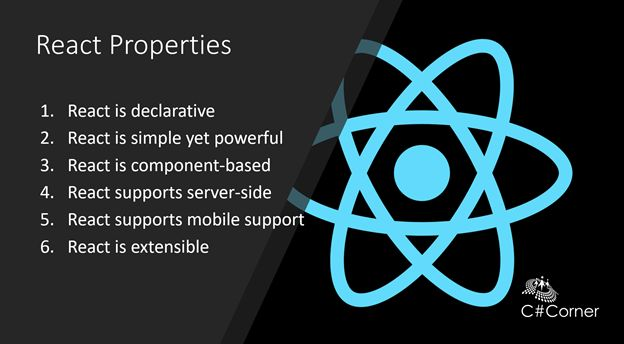
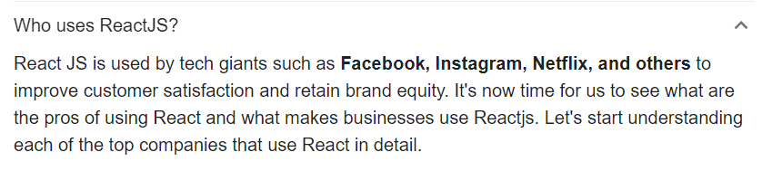

# What is React?
## React is an open source JavaScript library for developing user interfaces. React can be used to develop single page and mobile applications.

# Who supports React?
## React is developed and maintained by Facebook and a community of individual developers and corporations.

# Why we should learn React?
## React saves you time and money on development because it's component-based. You can break down an interface into reusable components that allow you to build dynamic user interfaces. This taps into the current thinking behind 'Design Systems'.
# What is NodeJs?
## Node.js is a server-side platform built on Google Chrome's JavaScript Engine (V8 Engine). Node.js was developed by Ryan Dahl in 2009.

# What is NPM?

## npm is the default package manager for the JavaScript runtime environment Node.js.
# How to create React App
1. ## Create a new folder with name of ReactApplications in Documents
2. ## Open Directory in Visual Studio Terminal 
3. ## Type below command
## npx create-react-app my-app
## cd my-app
## npm start

# What is DOM?
## The Document Object Model (DOM) is a programming interface for web documents. It represents the page so that programs can change the document structure, style, and content.
# Dom in real world is similar to upside down tree
## DOM elements work really slow because it has useless things
# What is Virtual DOM?
## A virtual DOM object is a representation of a DOM object, like a lightweight copy

# Why JSX?
## React embraces the fact that rendering logic is inherently coupled with other UI logic: how events are handled, how the state changes over time, and how the data is prepared for display.
## React doesn’t require using JSX, but most people find it helpful as a visual aid when working with UI inside the JavaScript code. It also allows React to show more useful error and warning messages.

